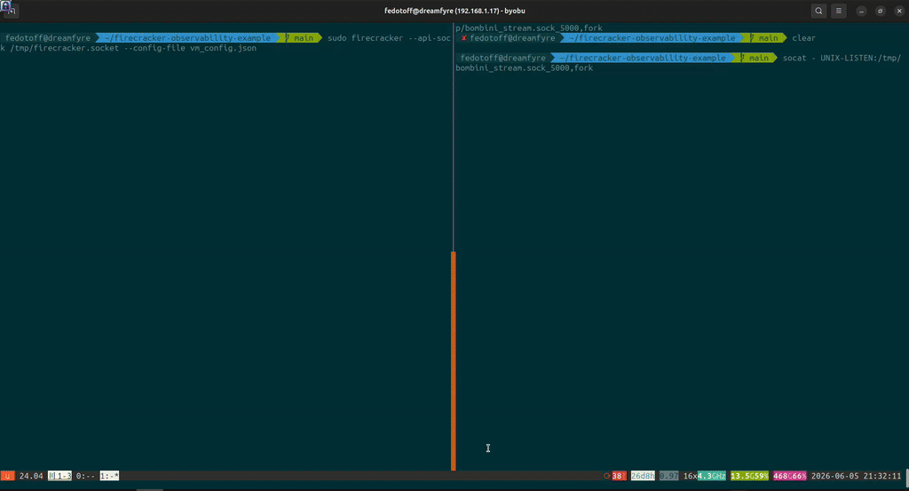

# Firecracker MicroVM Observability with Bombini



This repository provides an example of using [Bombini](https://github.com/bombinisecurity/bombini) for security observability Firecracker workloads.

## Reproducing Steps

First, install [Firecracker](https://github.com/firecracker-microvm/firecracker/blob/main/docs/getting-started.md).

```bash
ARCH="$(uname -m)"
release_url="https://github.com/firecracker-microvm/firecracker/releases"
latest=$(basename $(curl -fsSLI -o /dev/null -w  %{url_effective} ${release_url}/latest))
curl -L ${release_url}/download/${latest}/firecracker-${latest}-${ARCH}.tgz \
| tar -xz

sudo mv release-${latest}-$(uname -m)/firecracker-${latest}-${ARCH} /usr/local/bin/firecracker
```

### Linux kernel

Build custom kernel image with eBPF support. I used this [repo](https://github.com/oliver006/minimal-firecracker-linux-kernel) to automate the build.

We will build 6.8.12 kernel for x86_64 in this example.  You have to install [Docker engine](https://docs.docker.com/engine/install/) first.

Type `make` in your terminal to build the kernel.

### Rootfs with Bombini

Create rootfs image and mount:

```bash
dd if=/dev/zero of=rootfs.ext4 bs=1M count=1024
mkfs.ext4 rootfs.ext4
mkdir /tmp/my-rootfs
sudo mount rootfs.ext4 /tmp/my-rootfs
```

Download prepared alpine rootfs:

```bash
wget https://dl-cdn.alpinelinux.org/alpine/v3.23/releases/x86_64/alpine-minirootfs-3.23.0-x86_64.tar.gz
```

Extract alpine files:

```bash
sudo tar -xpf alpine-minirootfs-3.23.0-x86_64.tar.gz \
    --numeric-owner \
    --xattrs \
    --acls \
    -C /tmp/my-rootfs
```

Download Bombini release and extract it:

```bash
wget https://github.com/bombinisecurity/bombini/releases/download/v1.0.0/bombini-v1.0.0.tar.gz
tar -xvf bombini-v1.0.0.tar.gz
```

Copy Bombini's binaries, configs and init.sh to rootfs:

```bash
sudo cp -vRf bombini/usr/local/* /tmp/my-rootfs/usr/local/
sudo cp ./init.sh /tmp/my-rootfs/
```
Optionally, you can modify config files to enable various events (see [configuration](https://bombinisecurity.github.io/bombini/configuration/configuration.html)). By default only process execution/exit events are enabled.

Disable dumping events to file. We will use unix socket:

```bash
sudo sed -i 's/^log_file:/# log_file:/' /tmp/my-rootfs/usr/local/lib/bombini/config/config.yaml
```

Download and install socat binary to open Virtio-vsock for Bombini logs

```bash
docker run --rm -v /tmp/my-rootfs:/mnt alpine:3.23 sh -c "apk add --root /mnt socat"
```


Unmount rootfs with  `sudo umount /tmp/my-rootfs`.

## Run Firecracker

First, install socat and listen socket by runing this commands in 1st terminal:

```bash
sudo apt install socat
socat - UNIX-LISTEN:/tmp/bombini_stream.sock_5000,fork
```
Where start bombini as daemon connected to vsock inside VM, before `exec /bin/sh` (details in [init.sh](init.sh)).

Start the Firecracker VM in 2nd terminal:

```bash
sudo firecracker --api-sock /tmp/firecracker.socket --config-file vm_config.json
```

When VM boot is finished you can execute command in shell and see Bombini events in 1st terminal!